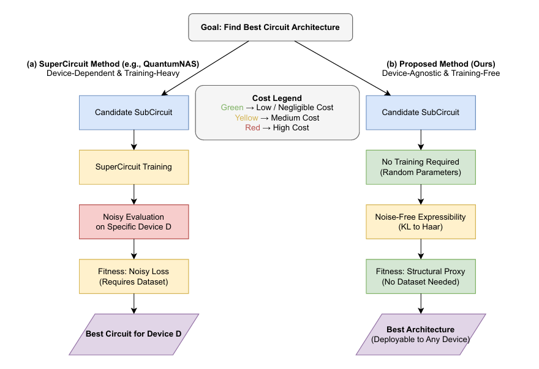

# Training-Free Quantum Architecture Search via Expressibility

🚀 Official implementation of the paper:

**"Training-Free Quantum Architecture Search Under Realistic Noise via Expressibility-Guided Evolution"**
Published in *Entropy (MDPI), 2026* https://www.mdpi.com/1099-4300/28/3/330

---

## 📖 Overview

Designing robust parameterized quantum circuits (PQCs) in the NISQ era is challenging due to:

* hardware noise
* expensive SuperCircuit training
* device-specific evaluation

This work proposes a **training-free and device-agnostic quantum architecture search (QAS)** framework based on **expressibility**.

---

## 🧠 Key Idea

Instead of:

❌ Training large SuperCircuits + noisy evaluation

We use:

✅ **KL-based noise-free expressibility** as a structural proxy

This enables:

* no training during search
* no noise simulation during search
* reusable architectures across quantum devices

---

## 🖼️ Framework Comparison

**Figure:** Comparison between:

* (a) SuperCircuit-based QAS (e.g., QuantumNAS)
* (b) Proposed expressibility-guided training-free QAS

👉 Our method removes:

* SuperCircuit training
* repeated noisy evaluation during search

---

## ⚙️ Installation

Create environment and install dependencies:

pip install -r requirements.txt

---

## 🚀 Usage

### 1️⃣ Train SuperCircuit (Baseline)

python train_supercircuit.py --config configs_train_supercircuit_mnist.yml

---

### 2️⃣ Expressibility-Guided Search (Ours)

python expr_search_mnist.py --config configs_mnist.yaml

Fashion-MNIST:

python expr_search_fashion_mnist.py --config configs_fashion_mnist.yaml

👉 This implements:

* random search
* expressibility-guided evolutionary search (our method)

---

### 3️⃣ QuantumNAS-style Baseline

python quantumnas_style_search.py --config configs_mnist.yaml

👉 Includes:

* SuperCircuit-based evaluation
* noisy performance estimation

---

## 📁 Repository Structure

.
├── torchquantum/                  # Quantum simulation backend (adapted from TorchQuantum)
├── configs_*.yaml                # Experiment configurations
├── train_supercircuit.py         # SuperCircuit training
├── expr_search_mnist.py          # Expressibility-guided search (MNIST)
├── expr_search_fashion_mnist.py  # Expressibility search (Fashion-MNIST)
├── quantumnas_style_search.py    # QuantumNAS-style baseline
├── expressibility_both_case.py   # Expressibility computation
├── loss_expr_relation.py         # Correlation analysis
├── spearman_utils.py             # Ranking metrics
├── requirements.txt              # Dependencies

---

## 🔧 Implementation Details

This project builds upon and utilizes components from:

* TorchQuantum: https://github.com/mit-han-lab/torchquantum

We thank the authors for providing an open-source quantum machine learning framework.

---

## 📊 Key Results

| Method                    | Accuracy |
| ------------------------- | -------- |
| Random Search             | 0.62     |
| QuantumNAS-style          | **0.75** |
| **Ours (Expressibility)** | 0.71     |

👉 Our method achieves:

* competitive performance
* significantly lower computational cost
* fully training-free search phase

---

## ⚡ Advantages

* No SuperCircuit training
* No noisy evaluation during search
* Device-agnostic architectures
* Efficient and scalable
* Reduced computational cost

---

## 📌 Citation

If you use this code, please cite:

@Article{e28030330,
AUTHOR = {Mousavi, Seyedali and Mousavi, Seyedhamidreza and Pettersson, Paul and Daneshtalab, Masoud},
TITLE = {Training-Free Quantum Architecture Search Under Realistic Noise via Expressibility-Guided Evolution},
JOURNAL = {Entropy},
VOLUME = {28},
YEAR = {2026},
NUMBER = {3},
ARTICLE-NUMBER = {330},
URL = {https://www.mdpi.com/1099-4300/28/3/330},
ISSN = {1099-4300},
DOI = {10.3390/e28030330}
}

---

## 📬 Contact

Seyed Ali Mousavi
[seyedali.mousavi@mdu.se](mailto:seyedali.mousavi@mdu.se)
Mälardalen University, Sweden

---

## ⭐ Acknowledgment

This work was supported by:

* Swedish Research Council (GreenDL)
* NAISS supercomputing infrastructure
* European Union & Estonian Research Council

---

## ⚠️ Notes

* The search phase is **fully training-free**
* Final performance requires training selected architectures
* Experiments use IBM Qiskit fake backends for realistic noise simulation

---

## 🔮 Future Work

* Larger qubit systems
* Joint architecture–mapping optimization
* Deployment on real quantum hardware
